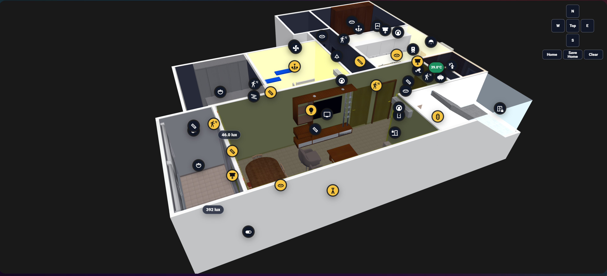
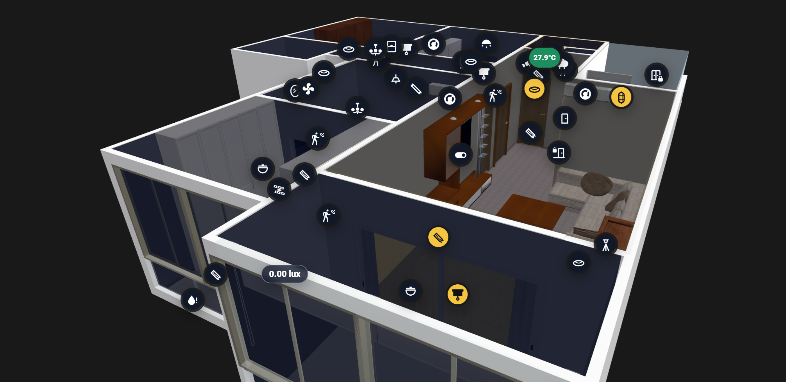
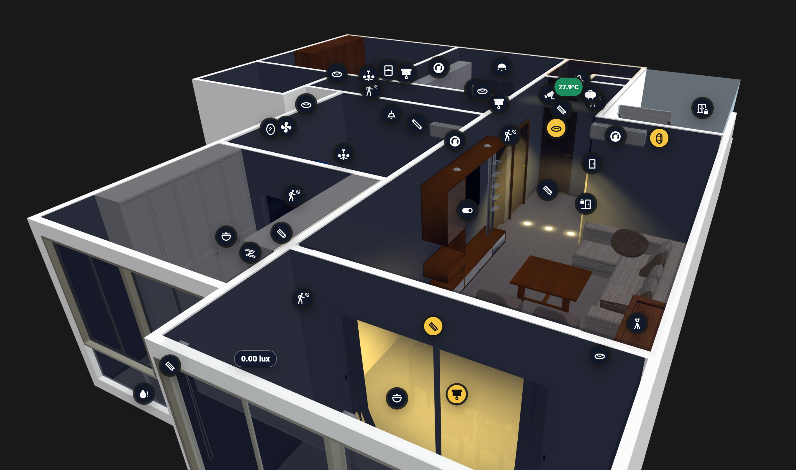

# Home Assistant 3D Floorplan



A Lovelace custom card for placing Home Assistant entities on a 3D model and rendering physically-based lighting directly in the browser. Load a `.glb`, switch to Edit Mode, select an entity from the sidebar, click the model to place it, then configure lighting zones and light types for a realistic room render.

The card element is `custom:home-assistant-3d-floorplan`.

## Install

Add this JavaScript resource in Home Assistant:

```yaml
url: /local/Home-Assistant-3D-Floorplan.js
type: module
```

If installed through HACS:

```yaml
url: /hacsfiles/Home-Assistant-3D-Floorplan/Home-Assistant-3D-Floorplan.js
type: module
```

## Basic Card

```yaml
type: custom:home-assistant-3d-floorplan
title: 3D Floorplan
model: /local/floorplans/home.glb
view_mode: "3d"
markers: []
```

## Coordinate System

The card uses the standard Three.js / GLTF coordinate convention:

- **X** - east/west floor axis
- **Y** - vertical (height)
- **Z** - north/south floor axis

This matches `.glb` files exported from Blender with the default Y-up orientation. No `coordinate_map` override is needed for standard exports.

## Markers

Marker colors reflect live entity state:

- Red: unavailable or unknown
- Yellow: active / on / open / detected
- Dark: inactive / off / closed / clear
- Green: available neutral state

Default press actions:

```yaml
marker_tap_action: auto
marker_hold_action: auto
edit_marker_tap_action: select
edit_marker_hold_action: move
marker_hold_ms: 650
```

`auto` uses domain defaults - lights and switches toggle on tap; sensors, binary sensors, and climate entities open more-info. Edit Mode is shown only when `hass.user.is_admin === true`.

Markers export as:

```yaml
markers:
  - entity: light.kitchen
    name: Kitchen Light
    icon: mdi:lightbulb
    tap_action: toggle
    hold_action: more-info
    light_intensity: 100
    light_type: spot
    light_radius: 120
    x: 850.0000
    y: 230.0000
    z: 610.0000
```

Temperature and humidity sensors show their live value on the marker. Use **Marker display** in Edit Mode to force icon or value display:

```yaml
marker_display: value   # auto | icon | value
```

## Edit Mode

Switch to Edit Mode to place and configure markers.

**Sidebar** - lists all HA entities. Placed markers show a **Remove** button. Unplaced markers show **Add**; clicking it then clicking the 3D model places the marker at that surface point.

**Floating panel** - selecting a placed marker opens a panel on the right with:
- Icon picker
- Marker display setting
- Tap / Hold actions
- Light intensity, type, radius, and render parameters (for `light.*` entities in Positional zones)
- XYZ coordinates
- Move / Delete buttons


**Axes gizmo** - a small XYZ orientation indicator appears in the top-left corner in Edit Mode, showing how the model axes relate to the camera.

**Export YAML** - the sidebar exports the full card YAML with current marker positions, zone definitions, and presets. Press **Copy YAML** to copy it to the clipboard.

## Camera Views

The compass in the corner provides:

- **Top** - straight top-down view
- **N / E / S / W** - 45-degree angled side views

In Edit Mode, **Save Home** stores the current camera position as the startup view. The saved view is stored per-floor and is written to the YAML export:

```yaml
default_view:
  position: [6.2500, 4.5000, 8.7500]
  target: [0.0000, 0.8000, 0.0000]
  zoom: 1.0000
```

## Brightness Areas (Lighting Zones)

Edit Mode can define room polygons that drive the 3D lighting render. Press **Add Area**, then **Draw**, and click the floor to trace the room boundary.

### Lighting Modes

Each zone has two modes, selectable in the zone settings:

**Area (zone-wide glow)** - a single flat ambient fill covers the whole floor polygon. Suitable for zones with diffuse overhead lighting or when no individual light positions are needed.



**Positional (per-light pools)** - each `light.*` marker placed inside the zone creates its own floor pool, wall glow, ceiling glow, and GI bounce based on its position and light type.



### Zone Settings

```yaml
brightness_zones:
  - id: living-room
    name: Living Room
    color: "#f8d66d"
    height: 280
    day_opacity: 0.50
    night_opacity: 1.00
    lighting_mode: positional
    illuminance_enabled: true
    illuminance_entity: sensor.living_room_lux
    show_lux: true
    points:
      - x: 100.0000
        y: -300.0000
      - x: 900.0000
        y: -300.0000
      - x: 900.0000
        y: -1100.0000
```

**Illuminance sensor** - when enabled, the shade is driven dynamically by a lux sensor. Low lux approaches night shade; 300 lux reaches day shade; brighter reduces shade further. The sensor is selected from a searchable dropdown of all `sensor.*` and `input_number.*` entities. Falls back to `sun.sun` day/night when disabled or sensor is unavailable.

## Light Types (Positional Mode)

Each `light.*` marker in a Positional zone has a **Light type** that controls how the glow is rendered on floors, walls, and ceilings.

| Type | Description |
|---|---|
| **Spot** | Ceiling downlight. Renders a cone on the wall with inner/outer angle, a bright floor hotspot, and GI bounce. Supports tilt X/Y to aim off-center. |
| **Cove** | Indirect ceiling bounce. Produces a top-heavy wall wash that fades downward and a soft uniform floor fill centered on the zone. |
| **Linear** | LED strip. Elongated floor pool; wall wash runs the length of the strip path. |
| **Lamp** | Floor or table lamp. Tight floor pool, soft wall glow radiating outward. |

Set **Light radius** to override the auto-computed pool size (in model units). Leave blank for automatic sizing based on mount height and zone dimensions.

### Light Paths (Linear / Cove)

Linear and Cove lights support a drawn path that distributes sample points along the strip:

- **Draw line** - click the 3D model to add path points one by one
- **Rectangle** - define width, depth, and rotation; the card generates a closed 4-corner loop automatically. The marker position becomes the rectangle center.

### Sub-spots (Spot)

A spot marker can contain multiple render-only sub-spots - extra light positions that share the parent entity state but each have their own XYZ position and render parameters. Useful for a single HA entity that controls a row of ceiling spots.

## Render Parameters

Every light marker has a full set of render parameters accessible in the **Advanced** section of the floating panel. Parameters are grouped into four sections:

### Core
| Param | Description |
|---|---|
| `intensity` | Overall brightness multiplier |
| `distance` | How far the light reaches - affects wall reach and floor pool size |
| `decay` | Falloff speed. Low = soft wide wash. High = sharp tight edge |

### Light Shape
| Param | Applies to | Description |
|---|---|---|
| `angle` | Spot | Cone half-angle in radians. Smaller = narrower beam |
| `penumbra` | Spot | Softness of cone edge. 0 = hard cut, 1 = fully feathered |
| `tilt_x` | Spot, Linear, Cove | Tilts the light in the X floor direction |
| `tilt_y` | Spot, Linear, Cove | Tilts the light up/down |
| `width` | Linear, Cove | Width of the rectangular light source |
| `height` | Linear, Cove | Height of the rectangular light source |

### Floor Pool
| Param | Description |
|---|---|
| `floor_hotspot_size` | Size of the bright core relative to the main pool. Most effective on Spot, Lamp |
| `floor_saturation` | Color saturation of the floor glow. 0 = grey, 1.5 = vivid |
| `floor_outer_size` | Radius multiplier of the wide ambient scatter layer |
| `floor_outer_brightness` | Brightness of the outer scatter layer |
| `gi_brightness` | GI bounce intensity - secondary soft floor fill. 0 = disabled |
| `gi_radius` | Radius multiplier of the GI bounce mesh |
| `gi_warmth` | Warms the GI bounce color to simulate warm floor reflection |

### Wall Glow
| Param | Description |
|---|---|
| `wall_intensity_scale` | Multiplier for overall wall glow brightness |
| `wall_height_limit` | Fraction of zone height the wall mesh covers. 1.0 = full wall |
| `wall_lower_bias` | Shifts glow center down the wall. 0 = near fixture, 1 = near floor |

Hovering over any parameter value shows a tooltip with a description and which light types it is most effective on.

### Presets

Parameter sets can be saved as named presets and reused across lights:

- **Save as preset** - prompts for a name and stores the current resolved values
- **Reset** - clears all per-light overrides and returns to type defaults
- **Export** - downloads the resolved parameters as a `.json` file
- **Import** - loads a previously exported `.json` and applies it to the current light

Presets are saved to `localStorage` and survive JavaScript file updates. The YAML export also includes the `light_presets:` block so they can be committed to the card config:

```yaml
light_presets:
  narrow_spot:
    angle: 0.25
    penumbra: 0.3
    wall_intensity_scale: 1.2
```

Per-light overrides and preset assignments export with the marker:

```yaml
markers:
  - entity: light.hallway_spot
    light_type: spot
    light_preset: narrow_spot
    render_params:
      tilt_x: 15
      wall_lower_bias: 0.2
    x: 500.0000
    y: 230.0000
    z: 400.0000
```

## Floor and Ceiling Glow Clipping

All floor pools, ceiling glows, and GI bounce meshes are clipped to the zone polygon boundary. Light cannot bleed through walls into adjacent rooms regardless of pool radius.

## Multiple Floors

```yaml
type: custom:home-assistant-3d-floorplan
title: Home Floorplan
view_mode: "3d"
floors:
  - id: ground
    name: Ground Floor
    model: /local/floorplans/ground-floor.glb
    markers: []
    brightness_zones: []
  - id: first
    name: First Floor
    model: /local/floorplans/first-floor.glb
    markers: []
    brightness_zones: []
```

## Offline / Three.js Setup

### What is and isn't local by default

When you install via HACS or manually, the card file (`Home-Assistant-3D-Floorplan.js`) is stored locally on your Home Assistant instance. Your `.glb` model is also served from your local `/www/` folder.

However, **Three.js (the 3D engine) is not bundled by default**. The card fetches it from the external CDN `esm.sh` on first load:

```yaml
three_url: "https://esm.sh/three@0.165.0"   # default - requires internet
```

This means an internet connection is required on every page load unless you take the extra step below.

### Making it fully offline (recommended)

The repository includes a pre-built bundle at `dist/three.bundle.min.js`. Copy it to your Home Assistant `www` folder:

```
/config/www/three.bundle.min.js
```

Then point the card at it:

```yaml
type: custom:home-assistant-3d-floorplan
title: 3D Floorplan
model: /local/floorplans/home.glb
three_bundle_url: /local/three.bundle.min.js
```

With this in place, **everything runs 100% offline** - no external requests, no CDN dependency. This also fixes loading issues in the Home Assistant Companion App on iOS/Android, which can block remote module imports.

### Alternative - host individual Three.js files

If you prefer to host the individual modules rather than the bundle:

```yaml
three_url: /local/vendor/three/three.module.js
gltf_loader_url: /local/vendor/three/GLTFLoader.js
obj_loader_url: /local/vendor/three/OBJLoader.js
orbit_controls_url: /local/vendor/three/OrbitControls.js
```

Use matching files from Three.js release `0.165.0`.

## Performance Notes

- Use `.glb` format - single file, browser-optimised, carries geometry, materials, and textures together
- Zone polygon complexity affects floor pool rendering - simpler polygons with fewer vertices render faster
- Increase `light_radius` and reduce sample count for Linear/Cove lights covering large areas
- The GI bounce (`gi_brightness`) is disabled by default; enable only where the extra ambient fill is visible
